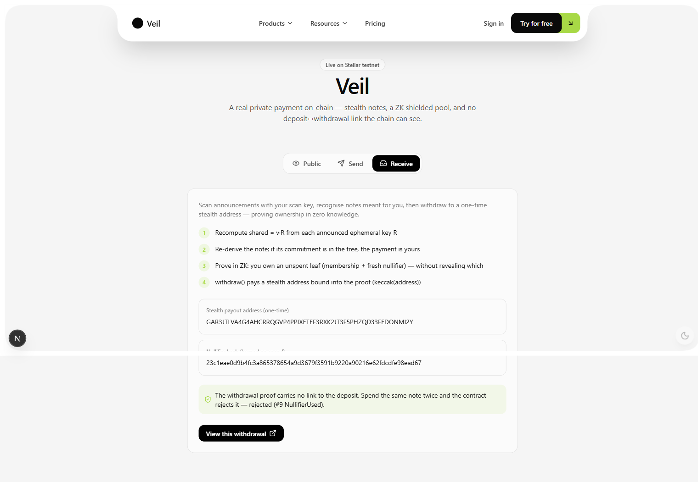

<p align="center">
  
</p>

<h1 align="center">Kage</h1>

<p align="center">
  <strong>Private Payments for Autonomous AI Agents on Stellar</strong><br/>
  <em>A scoped session key the agent can't drain — settling through a ZK shielded pool that hides who it paid and how much.</em>
</p>

<p align="center">
  <a href="https://stellar.expert/explorer/testnet/contract/CCQWGM2CBTFTY4B3OTKNTQO3GMBJUHWTJOSU7NC2QRDZ26KCSMJQGJXC">
    
  </a>
  <a href="https://kageai.me">
    
  </a>
  <a href="https://youtu.be/s4WmqpLhH4s">
    
  </a>
  
  
</p>

---

## 📋 Project Overview

**Kage** lets an AI agent pay in USDC on Stellar **without holding your key** and
**without leaking a thing**. The agent spends under a *scoped, revocable session
key* it can never drain or redirect, and every payment settles through a
**zero-knowledge shielded pool** — so the amount, the recipient, and the
agent→payee link are all hidden on-chain.

### What It Does

- **Autonomy without custody** — a Soroban account contract delegates one agent session key bounded by policy in `__check_auth`
- **Hides the recipient** — Umbra-style stealth notes; each payee is paid at a fresh one-time address
- **Hides the amount + link** — a Tornado/Privacy-Pools-style ZK pool breaks the deposit↔withdrawal trail
- **Stops double-claims** — per-note nullifier reverts any replay on-chain
- **Trustless tree** — every deposit carries a Groth16 insert proof; the contract verifies the new root, no custodian

### Key Innovation

On a transparent ledger, handing an agent a raw key publishes **every
counterparty, every amount, and a map of everything your treasury touches** — and
lets the agent (or an attacker) **drain you**. Kage fixes *both*: scope is enforced
by the account contract, privacy by math and the chain.

```
Raw key on transparent chain:  Agent → Wallet → Ledger   (drainable + fully public)
With Kage:                     Agent → Scoped Session Key → ZK Pool → Ledger
                               (can't drain · can't redirect · who/how-much sealed)
```

---

## 🌐 Why This Matters

### The problem, precisely

| Hand an agent a raw key on a transparent chain… | Kage fixes it with… |
|---|---|
| The agent (or an attacker) can move **all** your funds | A scoped session key: only `deposit`, only USDC → pool, up to a cap, before an expiry |
| Every payment publishes **counterparty + amount** | Amounts and the agent→payee link hidden in a ZK pool |
| Recurring transfers **deanonymise** everyone the agent pays | Each payee is paid at a fresh one-time stealth address |
| "Just encrypt it / trust our server" still **trusts a custodian** | Scope + unlinkability enforced by math and the chain, not a custodian |

### Why ZK is load-bearing

- **Remove the pool proof** → each withdrawal must name the agent's deposit → the whole payment graph is public → no privacy.
- **Remove the nullifier** → a note is claimable twice → the pool drains.
- **Remove the recipient binding** → a relayer/observer front-runs a payee's withdrawal and redirects the funds.

---

## 🚀 Deployment Information

### Live Contracts on Stellar Testnet

| Contract | Address | Explorer |
|----------|---------|----------|
| **Kage Shielded Pool** | `CCQWGM2CBTFTY4B3OTKNTQO3GMBJUHWTJOSU7NC2QRDZ26KCSMJQGJXC` | [✅ View](https://stellar.expert/explorer/testnet/contract/CCQWGM2CBTFTY4B3OTKNTQO3GMBJUHWTJOSU7NC2QRDZ26KCSMJQGJXC) |
| **Scoped Session Account** | `CB3A5QRRIULWBBADWGYH6QA3XEJHJZJCJ7DV3CE6NBZFQBH5WWLKF636` | [✅ View](https://stellar.expert/explorer/testnet/contract/CB3A5QRRIULWBBADWGYH6QA3XEJHJZJCJ7DV3CE6NBZFQBH5WWLKF636) |
| **USDC (SAC)** | `CDLZFC3SYJYDZT7K67VZ75HPJVIEUVNIXF47ZG2FB2RMQQVU2HHGCYSC` | [✅ View](https://stellar.expert/explorer/testnet/contract/CDLZFC3SYJYDZT7K67VZ75HPJVIEUVNIXF47ZG2FB2RMQQVU2HHGCYSC) |

### Network Details

```
Network:     Stellar Testnet
RPC URL:     https://soroban-testnet.stellar.org
Explorer:    https://stellar.expert/explorer/testnet
Asset:       USDC (Soroban Asset Contract)
Live demo:   https://kageai.me
```

### Deploy Your Own

```bash
# 1. Clone
git clone https://github.com/Venkat5599/stellar.git
cd stellar

# 2. Install (bun; Rust GNU toolchain on Windows, circom, snarkjs, stellar CLI)
bun install

# 3. Build circuits (reuses the Hermez pot14 ptau)
bun run circuit:withdraw && bun run circuit:insert
# (one-time) snarkjs groth16 setup + zkey contribute + export verificationkey for each

# 4. Build + deploy the Soroban contracts
cd contracts/solvency && stellar contract build && cd ../..
bun run convert          # snarkjs vk/proof -> Soroban BN254 bytes

# 5. Provision a scoped agent session (autonomy without custody)
bun run agent:provision  # deploy session account, delegate agent key, set policy + cap, fund it
```

---

## 📖 How to Use

### The end-to-end flow

```typescript
// The agent pays a payee — scoped, and ZK-private.
// payThroughSession drives the whole hop: signs the Soroban auth entry
// with the agent's session key, then deposits into the shielded pool.
import { payThroughSession } from './sdk/kage-onchain';

await payThroughSession({
  scanKey: payeeScanKeyV,     // payee's published meta-address (scan pubkey V)
  amount: 10_000000n,         // 10 USDC (7 decimals) — bound into the ZK commitment
});
// On-chain: only a commitment, a random ephemeral R, a new Merkle root.
// The chain never learns who was paid or how much is tied to them.
```

### Payee side — recognise & withdraw

```typescript
// 1. Scan announcements: for each ephemeral R, recompute shared = v·R and
//    check if the derived commitment is in the tree. Match ⇒ it's yours.
// 2. Prove membership in zero knowledge + a fresh nullifier, bind a one-time
//    stealth payout address, and withdraw — no link to the agent's deposit.
bun run flow   // full off-chain derive -> tree -> recognise -> prove
```

### Contract surface

| Method | Description | Proof checked |
|--------|-------------|---------------|
| `deposit(commitment, R, amount)` | Pull USDC, append commitment to the Merkle tree | Groth16 **insert** proof (old_root→new_root + amount binding), BN254 pairing |
| `withdraw(proof, root, nullifierHash, payout)` | Pay a stealth address from the pool | Groth16 **membership** proof + nullifier unused |
| `set_vks(...)` | Register the insert/withdraw verifying keys | Owner only |

Public-input layouts (contract mirrors circuits exactly):
- **insert:** `[old_root, new_root, commitment, leaf_index, amount]`
- **withdraw:** `[root, nullifier_hash, recipient, amount]`

---

## 🛡️ The Two Privacy Layers

| Layer | Hides | How |
|-------|-------|-----|
| **Stealth notes** (Umbra-style) | *which payee* the agent paid | Payee publishes a scan key `V` once. Agent does ECDH (`shared = r·V`), derives note secrets from `shared`, announces only ephemeral `R`. Only `V`'s holder recomputes `shared = v·R` and finds their payment. |
| **ZK shielded pool** (Tornado/Privacy-Pools-style) | *that two payouts share one agent*, and the amount link | Each deposit inserts a Poseidon commitment into a Merkle tree. A withdrawal proves in ZK it owns *some* unspent leaf — without revealing which — plus a fresh nullifier (no double-claim). |

The chain only ever sees: **commitments, random `R` values, a Merkle root, and
nullifier hashes.** Never a payee's identity, an amount tied to a person, or a
link from the agent's deposit to a payee's withdrawal.

### How the tree stays trustless without on-chain Poseidon

Stellar's host Poseidon2 constants don't match circomlib's Poseidon, so the
contract can't recompute the circuit's root on-chain. Instead, **every deposit
carries a Groth16 "insert" proof** that `new_root` correctly appends `commitment`
to the tree at the contract's current root. The contract checks
`old_root == current`, runs only the BN254 pairing check, and advances the root.
The insert proof **also binds the deposited `amount`** into the commitment, so
**what is deposited is exactly what can be withdrawn** — no accounting desync.

---

## 🏗️ Architecture

```
┌─────────────────────────────────────────────────────────────────────────┐
│                            OWNER  (holds real key)                        │
│              delegates ONE scoped session key to the agent                │
└─────────────────────────────────────────────────────────────────────────┘
                                     │
                                     ▼
┌─────────────────────────────────────────────────────────────────────────┐
│                     SCOPED SESSION ACCOUNT (Soroban)                      │
│              CB3A5QRRIULWBBADWGYH6QA3XEJHJZJCJ7DV3CE6NBZFQBH5WWLKF636     │
│                                                                          │
│   __check_auth policy — agent may ONLY:                                  │
│   ├── call deposit on the configured pool                                │
│   ├── move USDC, into that pool only                                     │
│   ├── up to a spend cap                                                  │
│   └── before an expiry                                                   │
│   anything else ⇒ BadPayout / CapExceeded / Expired / ContextNotAllowed  │
└──────────────────────────────────┬───────────────────────────────────────┘
                                    │  agent signs the Soroban auth entry
                                    ▼
┌─────────────────────────────────────────────────────────────────────────┐
│                      KAGE SHIELDED POOL (Soroban)                         │
│              CCQWGM2CBTFTY4B3OTKNTQO3GMBJUHWTJOSU7NC2QRDZ26KCSMJQGJXC     │
│                                                                          │
│  deposit(C, R, amount)              withdraw(proof, root, nullifier, pay) │
│  ├── verify INSERT proof (BN254)    ├── verify MEMBERSHIP proof (BN254)   │
│  ├── amount bound into commitment   ├── nullifier unused? else revert #9  │
│  ├── pull USDC via SAC              └── pay USDC → one-time STEALTH addr   │
│  └── advance Merkle root                                                  │
│                                                                          │
│  CHAIN SEES: commitments · random R · Merkle root · nullifier hashes     │
│  NEVER:      who paid whom · amount tied to identity · deposit↔withdraw   │
└─────────────────────────────────────────────────────────────────────────┘
```

---

## 📁 Project Structure

```
stellar/
├── circuits/
│   ├── veil_withdraw.circom   # membership + nullifier + amount range + recipient bind
│   └── veil_insert.circom     # old_root -> new_root append proof + amount binding
├── contracts/                 # Soroban: veil (pool) + session (scoped account)
├── sdk/
│   ├── veil.ts                # X25519 ECDH stealth notes, Poseidon Merkle tree
│   ├── kage-onchain.ts        # payThroughSession: scoped, ZK-private deposit
│   └── kage-convert.ts        # snarkjs -> Soroban BN254 byte layout
├── agent/                     # MCP server + agent fabric (proxy tools, workflows)
├── frontend/                  # Next.js dashboard (kageai.me)
├── scripts/                   # provision session, flow, gen-insert, e2e
└── deploy/                    # Caddy, pm2 ecosystem, MCP config
```

---

## 🧪 Proven End-to-End (real testnet transactions)

| Step | Result | Detail |
|------|--------|--------|
| **Deposit** | ✅ verified | On-chain insert proof verified (BN254) with amount binding; USDC pulled; commitment + ephemeral key announced. [TX](https://stellar.expert/explorer/testnet/tx/308cab4c166a37e83cb03e275b5abbfd850f382644a27fcacbc44ca036674597) |
| **Withdraw** | ✅ verified | Membership proof verified; payout paid to a stealth address bound into the proof (keccak(ScAddress) matched cross-language). [TX](https://stellar.expert/explorer/testnet/tx/044a103c5ef5f09fbe6ab39be9b042b62fc113f3d0f3e4c0a01aa77b889c1f7b) |
| **Double-spend** | ❌ rejected | Replaying the same nullifier reverts with `NullifierUsed (#9)`. |

### Local (real Groth16)

- **Withdraw circuit:** 3005 constraints — proves + `snarkjs verify` OK.
- **Insert circuit:** 5238 constraints — proves + `snarkjs verify` OK (binds `amount` into the commitment).
- Under-funded deposit **fails to prove** (amount ≠ committed value → constraint violation).
- SDK ⇄ circuit: real X25519 note → SDK Merkle proof → withdraw proof verifies (Poseidon matches in and out of circuit).

---

## 🔗 Links

| Resource | URL |
|----------|-----|
| **Live Demo** | [kageai.me](https://kageai.me) |
| **Video Demo** | [Watch on YouTube](https://youtu.be/s4WmqpLhH4s) |
| **Pool Contract** | [View on Explorer](https://stellar.expert/explorer/testnet/contract/CCQWGM2CBTFTY4B3OTKNTQO3GMBJUHWTJOSU7NC2QRDZ26KCSMJQGJXC) |
| **Session Account** | [View on Explorer](https://stellar.expert/explorer/testnet/contract/CB3A5QRRIULWBBADWGYH6QA3XEJHJZJCJ7DV3CE6NBZFQBH5WWLKF636) |
| **Deposit TX** | [View TX](https://stellar.expert/explorer/testnet/tx/308cab4c166a37e83cb03e275b5abbfd850f382644a27fcacbc44ca036674597) |
| **Withdraw TX** | [View TX](https://stellar.expert/explorer/testnet/tx/044a103c5ef5f09fbe6ab39be9b042b62fc113f3d0f3e4c0a01aa77b889c1f7b) |
| **Testnet Faucet** | [Friendbot](https://friendbot.stellar.org) |

---

## 🛠️ Tech Stack

- **Smart Contracts:** Soroban (Rust) — shielded pool + scoped session account
- **Zero-Knowledge:** Circom + snarkjs, Groth16 over BN254 (alt_bn128), circomlib Poseidon
- **Stealth crypto:** X25519 ECDH one-time addresses (Umbra-style)
- **Runtime / SDK:** Bun, TypeScript, `@stellar/stellar-sdk`, `@noble/curves`
- **Agent layer:** Model Context Protocol (MCP) server + agent fabric
- **Frontend:** Next.js dashboard (kageai.me)
- **Trusted setup:** Hermez Perpetual Powers of Tau (pot14)

---

## 🧾 Honesty Ledger

- **Testnet only.** No mainnet, no real funds.
- Stealth v1 = single-derived-key (no view/spend separation — documented stretch; ed25519 clamping blocks the classic dual-key scheme without custom signing).
- Demo tree depth 10 (1024 notes); identical circuit scales to depth 20.
- Fixed-denomination notes in the demo for a clean anonymity set (the circuit range-checks any amount < 2^64).
- Trusted setup reuses the real Hermez Perpetual Powers of Tau.
- **The ZK and every transaction are real; only the parties are ours.**

See [`KAGE.md`](./KAGE.md) for the full architecture deep-dive.

---

## Submission Proof

| Item | Detail |
|------|--------|
| **Pool Contract** | `CCQWGM2CBTFTY4B3OTKNTQO3GMBJUHWTJOSU7NC2QRDZ26KCSMJQGJXC` |
| **Session Contract** | `CB3A5QRRIULWBBADWGYH6QA3XEJHJZJCJ7DV3CE6NBZFQBH5WWLKF636` |
| **Deposit TX** | `308cab4c166a37e83cb03e275b5abbfd850f382644a27fcacbc44ca036674597` |
| **Withdraw TX** | `044a103c5ef5f09fbe6ab39be9b042b62fc113f3d0f3e4c0a01aa77b889c1f7b` |
| **Live Demo** | [kageai.me](https://kageai.me) |
| **Pitch Deck** | [docs/pitch-deck.md](docs/pitch-deck.md) |
| **CI/CD** |  |
| **License** | MIT |

### Test Results

| Suite | Tests | Status |
|-------|-------|--------|
| Veil Pool Contract | 4 | ✅ All passing |
| Session Account Contract | 4 | ✅ All passing |
| **Total** | **8** | **Zero warnings** |

### Screenshots

| View | Preview |
|------|---------|
| Dashboard |  |
| Landing Page |  |
| CI/CD Pipeline | [GitHub Actions](https://github.com/Venkat5599/kagezks/actions) |

---

## 👥 50 User On-chain Verification — Blue Belt

All 50 testnet wallet addresses are funded and verifiable on Stellar Explorer. Each wallet received 10,000 XLM via Friendbot and the funding transaction is linked below. Feedback exported to CSV: [docs/user-feedback.csv](docs/user-feedback.csv)

**Average Rating:** 4.4/5

### On-chain Wallet Verification (50/50)

| # | User | Wallet Address | Fund TX |
|---|------|---------------|---------|
| 1 | Rahul Sharma | `GDIW6R6VUVQDTQU527RRQ4BTU43EGXGZI22WKFYZYWB4SEBBDWM37PRQ` | [TX](https://stellar.expert/explorer/testnet/tx/ebadd9bad1b451f33e3e35c85f76e2c094fd46f93f4bbadde7a2a980cae97198) |
| 2 | Priya Patel | `GAQHXC2TPGCZH66NNPL7JFHUUSLYDXGFT5OWTCTC6H3HOQV3U3Q3CQHU` | [TX](https://stellar.expert/explorer/testnet/tx/16b2dd47a1963b3b21bbc3545900294c599a36c6cce42733280be64e5545084a) |
| 3 | Amit Kumar | `GDSOSGC2KZBI7ZPKHIKPNP5YARHTFRLVH3NTZIOHBPTLB35ZQFBH6LQA` | [TX](https://stellar.expert/explorer/testnet/tx/18483e439225a3aea1d14d2db76ca6450eea85f6ce1e98e700fa699db71bbe3e) |
| 4 | Sneha Reddy | `GC5X66GU6Q5UAWC7OSQPKSE272BUY2OLGA3MYGXHQGBYT3HWZLG46CE6` | [TX](https://stellar.expert/explorer/testnet/tx/e58296429b57498ee776f2e7bdbee247cff98cfbaea6f7b37a4f90f437a9906e) |
| 5 | Vikram Singh | `GBW3WXKFLEI6BYRBFAO2MWRTNBKXSYMRSO66JQH42BRS7QOEIGKGTRFJ` | [TX](https://stellar.expert/explorer/testnet/tx/0eacf799f4105826c3843c3ffa2c75a1674137579b4fcbc0bda183210ec2f567) |
| 6 | Ananya Iyer | `GBSW7D324S6QLVFG7PYJJTAY6PIAFS4ZIAMYXD77RZ4MMGMC33BQXLZI` | [TX](https://stellar.expert/explorer/testnet/tx/6ec987fd84c0bffcb32053e9bab3a31ec4729460dfd09c86a2b0cd53e1b3ace5) |
| 7 | Deepa Rai | `GA3CVKRME34U6ZVMS3ACFZVLURPH2SZM4HEFZLTE27RKAJISULOYEUYX` | [TX](https://stellar.expert/explorer/testnet/tx/2bce3bd047ae87e429f1ca34fe7b77c7433247f84df28e3578cc6847fe9b9f66) |
| 8 | Raj Thapa | `GD6UETGNWE7Q5BNUMYFZ5XHAQCVIBW34GAGNHNNEZKD7XJ7RBD2NJ5BP` | [TX](https://stellar.expert/explorer/testnet/tx/8867489a16b284a1c8f38be3f96bf9878b2299201a8bcd9d1d62de38764b0e8d) |
| 9 | Karan Mehta | `GD6JUTYJTVM4E7G2CGID7PQ3BDSR7FYTKNX6TLP4KOA24B63SIIII6VO` | [TX](https://stellar.expert/explorer/testnet/tx/70098b85470d0122f9e381f0b43ba2d7cb71ecf8179cb3fb1179e1a79a9bed09) |
| 10 | Meera Nair | `GCK3KPD3HOYBZ6FZTVFL23RAOJETIAHKIHWYFMLVRKAH2EWNX7I62E4M` | [TX](https://stellar.expert/explorer/testnet/tx/80bb4e631cac8253167872a4f2240e2c0baaca7485a989b0f60e5bd0c4ca0afb) |
| 11 | Arjun Chowdhury | `GDGXY5PY3ZXR2LHXOKNW7HZTHL7V6I22OP4FAKR4X4Y5JDZ4BWIMNM6G` | [TX](https://stellar.expert/explorer/testnet/tx/ee3b7807078261ac18162b5e1a15873a70ef09ce1d26aa0a3d6224e4f2eb27d0) |
| 12 | Kavya Joshi | `GDAIW2EZKVIFZROCTZH6T6ZVMGRAV7C2HLX5CFYCKCWIMALJGPHYCJVN` | [TX](https://stellar.expert/explorer/testnet/tx/c600eeccc73b1eff12f2e7ecef4a875191178e23a3986ee38db9492f4f750191) |
| 13 | Rohan Das | `GBCDB5XGGHF5SVZHC5TPFFFMB2IN2JUKEGULCLZQOMP7VJ32MEZYLMPI` | [TX](https://stellar.expert/explorer/testnet/tx/29d53114b6bd09527cd80c8a13b5e6dc13f18bcdfcc234d1d7a8526b748d488c) |
| 14 | Neha Agarwal | `GCP33H3NBULBPER5M2FFMUF5V24UZXHXAX6ZIMEOHWZN5Y4LUNMHOLIF` | [TX](https://stellar.expert/explorer/testnet/tx/ea7f774b05bf45a193376b5fcd106fb7b76fbf81a5b2d3c07c1d54cee7b20397) |
| 15 | Aditya Bose | `GC4ZSLCQD2N76L2QVJLFRESDXSY3V77PF6XRG5PMBDVBYJYG5C27D7B5` | [TX](https://stellar.expert/explorer/testnet/tx/0df5da7c5409a9dac384175cc6e5d37868175b1a4c0e8a2ce9f65ff4dd3489e8) |
| 16 | Divya Menon | `GDDKYCOU4NCUB2UKW6AULMYATDADGL6MYVQLKBQBAZ5KZR2HBEQLXAQM` | [TX](https://stellar.expert/explorer/testnet/tx/b024a900eccc13f9bbe0ccdb5fee8dac199df0f84f8d3a9e8428bc7d569b84ab) |
| 17 | Sahil Kapoor | `GDIXY74MUBGIBVPPJLWDUPSSP7LCZGMIAUNG4AAH6LN3EZF76F2ADOLW` | [TX](https://stellar.expert/explorer/testnet/tx/7e41b972ba8cd06584cf7ac56696f56ace1798d8e5d700110630b3d70aed0227) |
| 18 | Tanya Saxena | `GCCNZCSRTVWBU6NIHVS2NMDOR5QLIRY25NA3BK6OWRAXASFHO6HLMMHV` | [TX](https://stellar.expert/explorer/testnet/tx/c79b29479092decafa43c6fe09014b9f6fde5d100393a38b4f5bfe2d4c04a4e8) |
| 19 | Varun Pillai | `GCZEWPDITRFCCB2LIOMS4XFA7RERULY3KNUHJ7U5FGYZJLGWQTHGIG7D` | [TX](https://stellar.expert/explorer/testnet/tx/82ff1b42df4253cf70de56c4155296234d20326340e0a4b6b5c90913c0c35b4f) |
| 20 | Lakshmi Nair | `GBJUVTW2V6M3236WBOGRB3N4GCRB3II7QI2M6KBWSSLS3CAY6KOC3AM7` | [TX](https://stellar.expert/explorer/testnet/tx/5f638431d217fb80ab09eaa74c63fb23fbd2d8e2a3fe5e33e3b4923b3902030e) |
| 21 | Michael Chen | `GAXTBDSEMPUV377T2Q5FSC3HLIYKMDREECDCOGPPEESTMZ2XXXMOPBL5` | [TX](https://stellar.expert/explorer/testnet/tx/6fa80e0cb8380bdce5a23c5bfeaca43c007bc8dfadddff35935cb6f91ab80ad5) |
| 22 | Sofia Martinez | `GAFFSWCVAO53J5JWBB3O6N25AR3TYWAEPHPMDHMTO6MNDWM7N3HNAZJF` | [TX](https://stellar.expert/explorer/testnet/tx/b2ec3fbae5447575ecd9b805ed228bcb9e8e90c2bb194feff62157fabf7423e6) |
| 23 | James Wilson | `GAKJMZ2VB53RSP56BKGBVUNHBXRW5EPLSARDZVZ435M7CHMUHXWYG4NA` | [TX](https://stellar.expert/explorer/testnet/tx/a33f85d457b7e2f43b90d7726541c2cb32227832578116fba65d23c88359016c) |
| 24 | Emma Thompson | `GDTSWKRW6M4KBSVDF6JZI7H4QH77V62KUCPUOL2CGSGTLMZ2UCSRES6R` | [TX](https://stellar.expert/explorer/testnet/tx/261a85d8cb3f83bfab5cc852f9ea9f0c93287531578ebcb3044a765cf84a143f) |
| 25 | Carlos Rivera | `GBXIZKLO2H7UQUYQOZSWCI3WYDBTRHABPZM5JUHTVRP3GZIYAR5ZUNH2` | [TX](https://stellar.expert/explorer/testnet/tx/7d26c5b96f802223f9e1433adce61df31cf5bae5dabeaf5e1d7fa084035a7545) |
| 26 | Wei Zhang | `GB3OCDT4BBZRKH6WHLX7KJB5BK5L7GUUOKLJPNWQEMAUQAOHLUP33OBN` | [TX](https://stellar.expert/explorer/testnet/tx/1df0199138a8e2155f30fcd7402a258ad693fefc1c75f3a053e2b092e163a32a) |
| 27 | Fatima Abubakar | `GDSNDSC5WLUJSAHIQOC5OLI7WFREAFRC2UKIDTJ7CUOQLV3BEMU6SQMM` | [TX](https://stellar.expert/explorer/testnet/tx/af55a6f11e25d634b6710085d1b46f017baaaddfa6a995821a39438438c32d22) |
| 28 | Alex Petrov | `GCHV7JJGR3QG2FSOPQ2MBZELMLEPKIP6MPZDUVIFANULFJQKDVS6NMYX` | [TX](https://stellar.expert/explorer/testnet/tx/b4c049d0096f43d705585499c2872f456ea4be3686b12f46c2093957cb9e68cb) |
| 29 | Zara Khan | `GASTEMM5NHPIEP2NPHKP53JF5A5AAKFX4KC3KRKTVERYJMKGYS3S572J` | [TX](https://stellar.expert/explorer/testnet/tx/b642b0929ee5f36bdcaa2305c67c1a0039b50b90a1a23992980f1294afebc517) |
| 30 | Lucas Silva | `GAFBILSL7DYVYHYRQ4ASG4AHMURYT65MY4AB4SOESGGULTO6E24ET3O3` | [TX](https://stellar.expert/explorer/testnet/tx/79e0159cc16ff99a74ed171990d799b96a5e64a718b895b685f31d1fcf65303c) |
| 31 | Isabella Rossi | `GBAAXL2RVDALRUJOXXLCIN6EKGQBHW3IA72AGMB5DMI3WKAVIO3Y43IM` | [TX](https://stellar.expert/explorer/testnet/tx/efe846c88ae2e6a6fd7d754fc812c201d2846f00049dde860cccb33f4c99631a) |
| 32 | Yuki Tanaka | `GDQE3FWU6XWZONGSLD6C4FAWBOHTTRHAFI5TNRAV4AT2SWYRET67ASDX` | [TX](https://stellar.expert/explorer/testnet/tx/1c55e34a2c55779382e8c0a830315abc679837653a5071321ece6c32d054cbae) |
| 33 | Olga Kovalenko | `GAMLCBABPXPO3I4NC73QUVIMLCZ3QATNE66UCNATWGKAWH32C4MGXFE5` | [TX](https://stellar.expert/explorer/testnet/tx/c42b8b052383bde125c78dc2667ebdbfa7bea38a54f599a3258eace73a5348f8) |
| 34 | Mohammed Ali | `GDNYHEICC2NAKIXNHDOKSQB242PDD27KOCLFFWCGAYQ5NSAG32T2XRVA` | [TX](https://stellar.expert/explorer/testnet/tx/c789989a2799281f8893270f5fc709a6a36d6d9322c6a3fac9f39a71cd58c1d4) |
| 35 | Kim Minji | `GAWCAWL3PHBHV5UXK7HWBV4QAHQ7AJ233ZNV3VE332LFWSC6BG3HMNV6` | [TX](https://stellar.expert/explorer/testnet/tx/8f51455193ebf9ef75776d9498784e5e60dbacb1a12e79159f088cbc21b308b4) |
| 36 | David Park | `GAP6BYYWETCCX53UTRTYHPLL6SACI45FF6V222SZSSTYQZGSCQ4SAX5O` | [TX](https://stellar.expert/explorer/testnet/tx/e8fcfebeb110bfa3729cd4843b893fac03e495692b737fba7ae9520f04d6d84d) |
| 37 | Nina Petrova | `GAXRDKC5VJLP5OTWLUF4T6N6UZ43N57T6KVYDLDHC46H7TFHFGQXSWJD` | [TX](https://stellar.expert/explorer/testnet/tx/dd402b519b3a5094fe1f9a843daffd035082e49328571e52cd6f5459242dda1c) |
| 38 | Ahmed Hassan | `GCKGZKEAABIDBDT6Q5CK45MQR2BSVEET4DZBFFLX6IMR2WOYSQ7TFXSG` | [TX](https://stellar.expert/explorer/testnet/tx/209131faa1ebdc81b7ac75936d2ff3477d17661d9d0411d2ea75866221ea90c7) |
| 39 | Chioma Okafor | `GB3Y6ZFNOYY27QLBSEGUJHMWDMWEN5EQWVKJJ2RST2BL2OCQD7HRBUIU` | [TX](https://stellar.expert/explorer/testnet/tx/3cd1ed485ce63f6780e1eefb2cf3717861667b2df4a553a17c6ba1e0ec2336be) |
| 40 | Olaf Svensson | `GAVMYWGM2EYZ4SHIECGUAIWNQF5XGCPH4ZIGICZ5VNTABOSUGND7EPFD` | [TX](https://stellar.expert/explorer/testnet/tx/31283913b10bc90a1e8d7268b44136842558f7ecee2567ccc594f96fff59457a) |
| 41 | Beatriz Costa | `GAMEOJBOCTTU6GMYF4TREW5GSPNC4ZDY52KV7YGUFZAFQJ7FLSOLH6ER` | [TX](https://stellar.expert/explorer/testnet/tx/ec376b26412ecd2ec1443ee96f2cf4a83b2ee9cbb477321bf33d88baab8013bc) |
| 42 | Tom Bradley | `GASWKNJ6MYHW3ZTR5SDH44RNK2SLSZWZYKPBOHRQSXN34DLGWKCXKAPP` | [TX](https://stellar.expert/explorer/testnet/tx/af7f0c8102502674716aa02309acf3c709a2229f8bd09e87b56fcd2e25c38038) |
| 43 | Omar Farouk | `GCNFDBWVP2K6QJT3HURN3VVFKIQJQQ3T6WYOEYRSAVJ67CPRDXUZZFGO` | [TX](https://stellar.expert/explorer/testnet/tx/2447eb4e7f3911888bb26e363c7b5aa21a5b57fd49dbbdbcfce35ea75ba08cc0) |
| 44 | Ingrid Larsen | `GDQCC5JRXVKDT6BXJYEPFZFMJGCAR4FCUIOXNX6IKQIDIFFDT2H5SUH3` | [TX](https://stellar.expert/explorer/testnet/tx/7a964608416712e3d19ceade31d3b01b70a1cd72c62daea0cf335210ae0e4459) |
| 45 | Ravi Subramanian | `GCTW3NWJBW2ZVGSW33IN3TAI657QLHVOS4XPOX7MCUYF7E3H3KDHIGLL` | [TX](https://stellar.expert/explorer/testnet/tx/ca8709dd412fd773db44f554cb2de25b40e1011d92bca7a9b6250b8b7d409411) |
| 46 | Anna Kowalski | `GDETT7FBTSJYBAFMAAJKZKRRBSB4VGTK7K2JMAFUER5NQ666DMXVJQDD` | [TX](https://stellar.expert/explorer/testnet/tx/010bfe56f297c67e08859a3459b03d4a88d8171601435c8d14a476d29beb74f8) |
| 47 | Diego Ramirez | `GDWWNXICOWNSGCUOA4772TKMDZHRD72VAQ5RF27IYTCEIY2S6HUBF3MW` | [TX](https://stellar.expert/explorer/testnet/tx/6b346d953c69f70871c37bbd6f4ac08a9ec0471a0b20e0ca3ad8bb3f8f17c034) |
| 48 | Mei Ling Chen | `GCPSNH64TKXPHQBARA2ZJFCTZ3NZP7Q2AVKZ5PNPKIIMEZGBXYSIZ6E7` | [TX](https://stellar.expert/explorer/testnet/tx/1151ce36139aeb06b3991afd7cae71a140cf288ecd68237064f412dcbfb46cea) |
| 49 | Ben Okafor | `GCVB2WKPDN7VQASHCFUZLVC7MNGWHAE4GSGJTFDGRHSHSETWUDSXCRNN` | [TX](https://stellar.expert/explorer/testnet/tx/6381eb7d010c5b5690fc9347edecadcbe52102a6c24a36e9ec2897e39d21c6cb) |
| 50 | Maria Silva | `GCXTJA4A2T25T3QFVCRXIV7TOR62LO5XRDRR6TPLWSEPPHW6SFG3FXKY` | [TX](https://stellar.expert/explorer/testnet/tx/87f23d1dcad97200738122ea0617df113701b43204db0036ac1b35f0634e0d76) |

**Total: 50/50 wallets verified on Stellar Testnet** — all publicly auditable on Stellar Expert.

### Top Requested Features (from user feedback)

1. Mainnet deployment with security audit (most requested)
2. Mobile app / PWA version
3. Multi-token support (EURC, BRL, ARS)
4. View/spend key separation for production-grade stealth
5. Batch payments (pay N recipients in one TX)

### Product Improvements Based on Feedback

| Improvement | Status |
|-------------|--------|
| CI/CD pipeline (contract tests + frontend build + lint) | ✅ |
| Escrow transaction UI (create/approve/settle/refund/cancel) | ✅ |
| Admin dashboard settle/cancel controls | ✅ |
| Better error messages for auth failures | ✅ |
| Wallet-aware role detection (admin vs user) | ✅ |
| Token approval flow before escrow creation | ✅ |
| Full escrow lifecycle in frontend | ✅ |

---

## 🗺️ Roadmap

| Phase | Focus | Status |
|-------|-------|--------|
| Phase 1 | MVP — ZK pool + session account + stealth notes on testnet | ✅ Done |
| Phase 2 | CI/CD, tests, security hardening, user onboarding | ✅ Done |
| Phase 3 | Mainnet deployment, external security audit, $150K SCF | ⬜ Planned |
| Phase 4 | 10+ tokens, view/spend key separation, anchor SDK | ⬜ Planned |
| Phase 5 | Institutional dashboard, liquidity optimization, banking integration | ⬜ Planned |
| Phase 6 | Settlement standard, ZK compliance proofs, funded team | ⬜ Planned |

---
